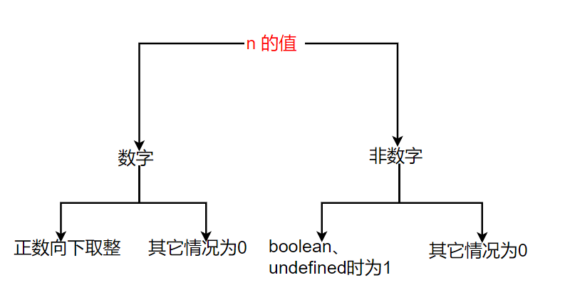

# 第二十五天编码任务
## 任务一
### 描述
---
我们假设要在某种特殊的机器人上写代码，但是这个机器人本身只实现了以下两个方法（函数）：

* Go，表示向当前方向前进一步
* TurnLeft，表示向左转  

现在请你自己写一个GoSteps函数，然后跑通下面的测试用例。
```

function Go() {
    console.log("Go");
}

function GoSteps(n) {
    ……
}

GoSteps(10); // Go 10次
GoSteps(1); // Go 1次
GoSteps(); // Go 1次，认为缺少参数时，默认参数为1
GoSteps(0);  // 0次
GoSteps(-1);  // 0次
GoSteps(1.4);  // Go 1次
GoSteps(1.6);  // Go 1次
GoSteps(-1);  // 0次
GoSteps(true);  // Go 1次
GoSteps(false);  // 0次
GoSteps("Test");  // 0次
GoSteps(NaN);  // 0次
GoSteps(null);  // 0次

```
### 思路
---
这里我将传入的 n 分为2种情况——数字与非数字：
1. 如果 n 的值为数字，则判断是否为正数，是则向下取整（调用 Go() 函数 n 向下取整次），否则不前进（不调用 Go() 函数）。
2. 如果 n 不为数字，则判断是否为 true 或者 undefined，是则前进一步（调用 Go() 函数一次），否则不前进（不调用 Go() 函数）。

